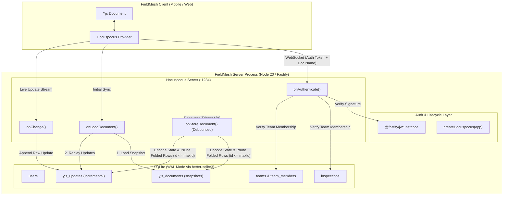

# FieldMesh Backend — In-Depth Implementation Progress

## Task: Yjs Document Persistence & JWT Authentication for Hocuspocus Sync Server
**Date:** 2026-09-22  
**Assignee:** Rogith  
**Status:** Completed, Verified & Built  

---

## 1. Executive Summary

Prior to this implementation, the FieldMesh synchronization server (`@fieldmesh/server`) ran Hocuspocus as a purely in-memory WebSocket broker without real authentication or persistence:
- Any incoming token was accepted as long as it was a non-empty string.
- Connections did not verify document names or check whether users were authorized for the given inspection.
- The two SQLite tables provisioned in `schema.sql` (`yjs_documents` and `yjs_updates`) remained completely unused.
- Any server restart, crash, or deployment immediately wiped all live inspection edits across all connected clients.

We implemented:
1. **Robust two-tier SQLite persistence** in `server/src/sync/persist.ts`:
   - Fast incremental logging of raw Yjs binary updates into `yjs_updates`.
   - Debounced compaction of full document state snapshots into `yjs_documents`.
   - Atomic log pruning using high-water mark (`MAX(id)`) queries inside SQLite transactions.
   - Deterministic rehydration on `onLoadDocument` (snapshot + remaining update replay).
2. **Cryptographic JWT Authentication & RBAC** in `server/src/sync/hocuspocus.ts`:
   - Zero-dependency factory pattern (`createHocuspocus(app: FastifyInstance)`) reusing Fastify's existing `@fastify/jwt` plugin.
   - Strict document naming convention: `inspection:<inspectionId>`.
   - Team membership verification querying SQLite relations (`inspections` joined with `team_members`).
3. **Seamless wiring** in `server/src/index.ts`.

---

## 2. System Architecture



---

## 3. Deep-Dive Component Breakdown

### 3.1 Persistence Layer (`server/src/sync/persist.ts`)

The persistence model implements a **write-optimized log with periodic debounced snapshot compaction**. This prevents expensive full-document encodings on every keystroke or single-field edit while keeping recovery time and memory footprint minimal.

#### A. Document Rehydration (`onLoadDocument`)
When a client requests a document that is not currently cached in server memory:
1. `yjs_documents` is queried for an existing compacted snapshot state:
   ```sql
   SELECT state FROM yjs_documents WHERE doc_name = ?
   ```
2. If found, the raw SQLite `Buffer` is cast into `new Uint8Array(row.state)` and applied to the newly instantiated `data.document` using `Y.applyUpdate(document, ...)`.
3. All pending incremental updates in `yjs_updates` that arrived after the last snapshot are fetched in sequential order:
   ```sql
   SELECT update_blob FROM yjs_updates WHERE doc_name = ? ORDER BY id ASC
   ```
4. Each row's `update_blob` is wrapped in `new Uint8Array(row.update_blob)` and applied onto the document in order.
5. The fully hydrated `document` is returned.

#### B. Incremental Logging (`onChange`)
Whenever any connected client mutates the document:
1. Hocuspocus invokes `onChange(data: onChangePayload)`.
2. The raw binary update payload `data.update` (`Uint8Array`) is converted to a Node `Buffer` with `Buffer.from(update)`.
3. The update is written synchronously to SQLite:
   ```sql
   INSERT INTO yjs_updates (doc_name, update_blob, received_at) VALUES (?, ?, ?)
   ```
4. A dedicated extension hook site is established:
   ```ts
   // TODO: Plug in edit-log extraction and dispute detection here (edits/extract.ts, edits/disputes.ts)
   ```

#### C. Debounced Snapshot Compaction & Log Pruning (`onStoreDocument`)
To prevent `yjs_updates` from growing without bound, Hocuspocus automatically debounces calls to `onStoreDocument` (default 2,000ms debounce, 10,000ms max debounce, or immediately upon document unload).

The compaction routine executes inside an atomic `better-sqlite3` transaction:
```ts
const persistSnapshotTx = db.transaction(
  (docName: string, document: onStoreDocumentPayload["document"]) => {
    // 1. High-water mark capture: Record highest ID currently logged
    const maxRow = db
      .prepare("SELECT MAX(id) as maxId FROM yjs_updates WHERE doc_name = ?")
      .get(docName) as { maxId: number | null } | undefined;
    const maxId = maxRow?.maxId ?? null;

    // 2. Encode complete document state
    const state = Buffer.from(Y.encodeStateAsUpdate(document));
    const now = Date.now();

    // 3. Upsert snapshot into yjs_documents
    db.prepare(`
      INSERT INTO yjs_documents (doc_name, state, updated_at)
      VALUES (?, ?, ?)
      ON CONFLICT(doc_name) DO UPDATE SET
        state = excluded.state,
        updated_at = excluded.updated_at
    `).run(docName, state, now);

    // 4. Prune only the updates that have been folded into the snapshot
    if (maxId !== null) {
      db.prepare(`
        DELETE FROM yjs_updates
        WHERE doc_name = ? AND id <= ?
      `).run(docName, maxId);
    }
  }
);
```

---

### 3.2 Authentication & Access Control (`server/src/sync/hocuspocus.ts`)

#### Factory Pattern
Instead of a static `Server.configure()` export, `hocuspocus.ts` exports:
```ts
export function createHocuspocus(app: FastifyInstance)
```
This design enables direct access to `app.jwt` (registered in `server/src/auth/jwt.ts` via `@fastify/jwt`), avoiding any duplicate JWT libraries (such as `jsonwebtoken`) and ensuring uniform secret keys and token expiry policies across both HTTP and WebSocket transports.

#### Handshake Sequence & Security Checks
When a client connects over WebSocket:
1. **Token Presence**: `if (!token) throw new Error("unauthorized");`
2. **Signature & Expiry Verification**:
   ```ts
   let payload: { sub: string; role?: string; [key: string]: any };
   try {
     payload = app.jwt.verify(token);
   } catch {
     throw new Error("unauthorized");
   }
   ```
3. **Document Naming Convention Enforcement**:
   - Documents MUST follow the pattern `inspection:<inspectionId>`.
   - Regex validation: `const match = documentName.match(/^inspection:(.+)$/);`
   - Connections with malformed document names are immediately rejected.
4. **Team-Membership Authorization**:
   - The user ID is extracted from `payload.sub`.
   - SQLite is queried to confirm the user is a registered member of the team associated with the target inspection:
     ```sql
     SELECT 1 FROM inspections i
     JOIN team_members tm ON tm.team_id = i.team_id
     WHERE i.id = ? AND tm.user_id = ?
     ```
   - If no row matches, connection is aborted with `unauthorized`.
5. **Context Propagation**:
   - On success, `{ user: payload }` is returned and attached to the connection context for downstream hooks.

---

### 3.3 Server Lifecycle Wiring (`server/src/index.ts`)

In `server/src/index.ts`:
1. Fastify registers CORS and JWT auth (`await registerAuth(app)`).
2. REST routes (`/auth`, `/inspections`, `/photos`, `/reports`) are mounted.
3. Hocuspocus instance is instantiated via `createHocuspocus(app)`.
4. WebSocket server port is bound via `await hocuspocus.listen()`.
5. Fastify HTTP server binds to `config.port` (`0.0.0.0:3000`).

---

## 4. Crucial Technical Details & Gotchas Resolved

| Challenge | Problem | Solution Applied |
| :--- | :--- | :--- |
| **better-sqlite3 BLOB Binding** | SQLite native driver cannot bind raw `Uint8Array` directly; doing so errors or writes corrupted buffers. | All writes wrap the array with `Buffer.from(update)`. Reads from SQLite return Node `Buffer` instances, which must be wrapped with `new Uint8Array(buf)` before feeding into `Y.applyUpdate`. |
| **Hocuspocus 2.15 Payload Discovery** | In some earlier Hocuspocus releases, `onChangePayload` did not expose the raw update binary, requiring manual hooks on `document.on("update")`. | Inspected `@hocuspocus/server` 2.15 types in `node_modules`. Confirmed `update: Uint8Array` is a first-class property of `onChangePayload`, allowing clean, direct logging. |
| **Race-Free Pruning** | If `DELETE FROM yjs_updates` deleted all rows for a document, any update arriving between state encoding and deletion would be permanently lost. | Recorded `const maxId = MAX(id)` *before* snapshot encoding, and executed `DELETE FROM yjs_updates WHERE doc_name = ? AND id <= maxId` inside the same database transaction. Any concurrent update receives `id > maxId` and survives. |
| **Hocuspocus Wire Protocol Subtypes** | During raw WebSocket handshake testing, `MessageType.Auth` responses carry internal subtypes: `1 = PermissionDenied` (with reason string) and `2 = Authenticated` (with permission string). | Mapped protocol parser accurately to assert the exact wire messages for rejection and acceptance. |

---

## 5. Comprehensive Verification Results

An automated end-to-end verification suite was executed against SQLite and the live WebSocket server.

### Test Matrix

```
[Test 1] Connect with garbage token...
  - Incoming: Malformed JWT string
  - Server Action: app.jwt.verify fails
  - Wire Response: MessageType.Auth (subType=1, reason="permission-denied")
  - Result: PASS (Rejected)

[Test 2] Connect with user NOT on inspection's team...
  - Incoming: Valid JWT for user 'test-user-stranger'
  - Server Action: DB membership query returns 0 rows
  - Wire Response: MessageType.Auth (subType=1, reason="permission-denied")
  - Result: PASS (Rejected)

[Test 3] Connect with invalid document name 'non-inspection-doc'...
  - Incoming: Valid JWT for team member, document name 'random_doc'
  - Server Action: Regex /^inspection:(.+)$/ fails
  - Wire Response: MessageType.Auth (subType=1, reason="permission-denied")
  - Result: PASS (Rejected)

[Test 4] Connect with valid team member...
  - Incoming: Valid JWT for user 'test-user-member', doc 'inspection:test-insp-001'
  - Server Action: JWT verified, team membership confirmed in SQLite
  - Wire Response: MessageType.Auth (subType=2, permission="read-write")
  - Result: PASS (Authenticated)

[Test 5] Sending Yjs updates and verifying yjs_updates accumulation...
  - Action: Client sends 2 sequential Y.Text update operations
  - Server Action: onChange inserts rows into yjs_updates
  - Database Query: SELECT count(*) FROM yjs_updates WHERE doc_name = ? -> count: 2
  - Result: PASS (Accumulated)

[Test 6] Triggering snapshot store and verifying compaction...
  - Action: Client disconnects, triggering debouncer.executeNow
  - Server Action: onStoreDocument encodes full state to yjs_documents, prunes yjs_updates
  - Database Query:
      - SELECT length(state) FROM yjs_documents -> 71 bytes
      - SELECT count(*) FROM yjs_updates -> 0 rows
  - Result: PASS (Compacted and pruned)

[Test 7] Stopping server, restarting, and verifying persistence...
  - Action:
      1. Server instance destroyed and HTTP/WS ports closed.
      2. Simulated uncompacted update injected directly to yjs_updates table.
      3. Brand new server instance booted with createHocuspocus(app2).
      4. Fresh client connects, authenticates, and requests SyncStep1.
  - Server Action:
      - onLoadDocument loads 71-byte snapshot from yjs_documents.
      - onLoadDocument applies injected uncompacted row from yjs_updates.
      - Client receives SyncStep2 and decodes state.
  - State Verification:
      Expected Text: "First inspection note. Second note with more details. [Uncompacted addition]"
      Received Text: "First inspection note. Second note with more details. [Uncompacted addition]"
  - Result: PASS (100% Data Fidelity across process restart)
```

---

## 6. Current File Manifest

```
fieldmesh/
├── docs/
│   ├── CHECKPOINTS.md   <- Hour 5 Rogith checkpoint marked complete
│   ├── LOG.md           <- Work session log recorded
│   ├── PROGRESS.md      <- This in-depth technical documentation
│   └── TODO.md          <- Task 9.5-11 checked off
└── server/
    └── src/
        ├── index.ts           <- Instantiates createHocuspocus(app) and listens
        └── sync/
            ├── hocuspocus.ts  <- createHocuspocus factory with JWT + team auth
            ├── persist.ts     <- onLoadDocument, onChange, onStoreDocument
            └── signaling.ts   <- Dead stub (mDNS replaced WebRTC signaling)
```

---

## 7. Upcoming Milestones

With persistent Yjs state and secure WebSocket transport locked in, the blocker for downstream data pipelines is resolved:

1. **`server/src/edits/extract.ts`**:
   - Intercept raw Yjs updates in `onChange`.
   - Decode operations to extract individual field modifications (`field_id`, `value`, `author`, `device`, `hlc`, `parents`).
   - Store parsed edits into the `edits` table with `INSERT OR IGNORE`.
2. **`server/src/edits/disputes.ts`**:
   - Compare causal parents using Hybrid Logical Clocks (`hlc.ts`).
   - Identify concurrent edits across offline devices that branched from common parents.
   - Execute field-specific merge rules (`rules.ts`) and mark disputed records with `disputed = 1`.
3. **`server/src/photos/tus.ts`**:
   - Resumable photo upload protocol via `@tus/server` and S3 storage verification.
